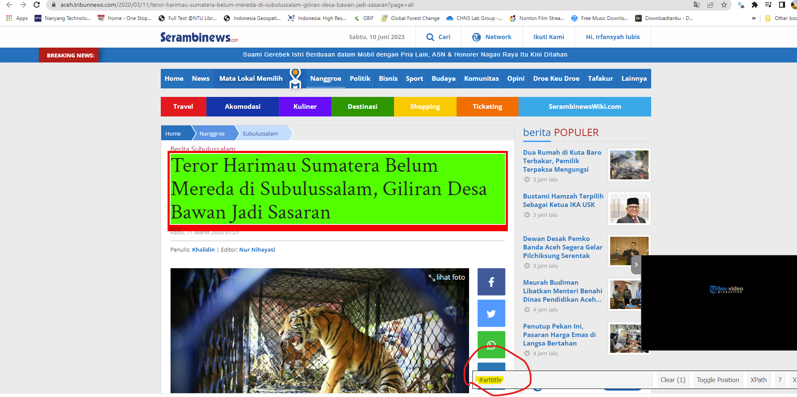

Tutorial Web Scrapping dan Teks Mining
================
Muhammad I. Lubis (<ilubis85@gmail.com>)

<!-- README.md is generated from README.Rmd. Please edit that file -->
<!-- badges: start -->
<!-- badges: end -->

## I. Apa itu web scrapping

Berdasarkan halaman
[Wikipedia](https://en.wikipedia.org/wiki/Web_scraping), web scraping
merujuk pada proses ekstraksi data secara otomatis dari situs web.
Dengan menggunakan beberapa baris *scripts* web scraping memungkinkan
pengguna untuk mengambil dan menguraikan halaman HTML atau data
terstruktur lainnya dari situs web, serta mengekstrak informasi yang
diinginkan. Dengan web scraping, pengguna dapat mengumpulkan data dari
berbagai halaman web, mengubahnya ke dalam format yang lebih
terstruktur, dan kemudian melakukan analisis atau menggunakan data
tersebut untuk berbagai tujuan.

## II. Apa tujuan atau kegunaan dari web scraping?

Web scraping adalah proses ekstraksi data dari situs web. Setelah data
dikumpulkan melalui web scraping, data tersebut dapat dianalisis dalam
berbagai cara tergantung pada jenis data dan tujuan analisis. Berikut
adalah beberapa jenis analisis umum yang dapat dilakukan menggunakan
data web scraping:

1.  Analisis Sentimen: Web scraping dapat digunakan untuk mengumpulkan
    data dari platform media sosial, situs ulasan, atau artikel berita,
    yang kemudian dapat dianalisis untuk menentukan sentimen terhadap
    produk, merek, atau topik tertentu. Teknik analisis sentimen dapat
    membantu mengidentifikasi sentimen positif, negatif, atau netral
    yang terungkap dalam data yang di-scraper.

2.  Riset Pasar: Web scraping dapat digunakan untuk mengumpulkan data
    tentang harga, fitur produk, ulasan pelanggan, atau informasi
    pesaing dari situs e-commerce. Data ini dapat digunakan untuk tujuan
    riset pasar seperti pemantauan harga, analisis tren, atau
    mengidentifikasi kesenjangan di pasar.

3.  Analisis Konten: Web scraping dapat digunakan untuk mengekstraksi
    data teks dari situs web, seperti artikel berita, pos blog, atau
    diskusi forum. Data ini dapat dianalisis menggunakan teknik seperti
    pemrosesan bahasa alami (natural language processing/NLP) untuk
    mengidentifikasi pola, topik, atau kata kunci yang menarik. Analisis
    konten dapat digunakan untuk tujuan riset, pemantauan tren, atau
    memahami pendapat pelanggan.

4.  Analisis Jaringan Sosial: Web scraping dapat digunakan untuk
    mengumpulkan data dari platform media sosial atau komunitas online.
    Data ini dapat digunakan untuk analisis jaringan sosial, yang
    melibatkan pemeriksaan hubungan antara individu, kelompok, atau
    organisasi. Analisis jaringan sosial dapat memberikan wawasan
    tentang aliran informasi, pengaruh, atau dinamika komunitas.

5.  Visualisasi Data: Data hasil web scraping dapat divisualisasikan
    menggunakan berbagai alat dan teknik. Visualisasi dapat membantu
    mengidentifikasi pola, tren, atau anomali dalam data. Representasi
    visual seperti grafik, diagram, atau peta dapat memudahkan
    interpretasi dan komunikasi wawasan yang diperoleh dari data yang
    di-scraper.

6.  Pembelajaran Mesin dan Pemodelan Prediktif: Data hasil web scraping
    dapat menjadi sumber daya berharga untuk melatih model pembelajaran
    mesin atau membangun model prediktif. Dengan mengumpulkan jumlah
    data yang besar, termasuk fitur-fitur yang menarik, web scraping
    memungkinkan pengembangan model yang dapat memprediksi hasil,
    mengklasifikasikan data, atau memberikan rekomendasi.

7.  Analisis Kompetitif: Web scraping dapat digunakan untuk mengumpulkan
    data tentang situs web pesaing, daftar produk, informasi harga, atau
    strategi pemasaran. Data ini dapat memberikan wawasan tentang posisi
    pasar, penawaran pesaing, atau strategi penetapan harga, membantu
    bisnis membuat keputusan yang terinformasi dan mendapatkan
    keunggulan kompetitif.

Itulah beberapa contoh jenis analisis yang dapat dilakukan menggunakan
data web scraping. Kemungkinannya sangat luas, dan teknik analisis yang
digunakan secara spesifik

## III. Apakah web scraping legal?

Pertanyaan yang sering muncul adalah apakah kegiatan web scraping legal
atau tidak. Berdasarkan informasi terbaru dari
[APIFYBlog](https://blog.apify.com/is-web-scraping-legal/#:~:text=can%20scrape%20everything.-,Myth%202%3A%20Web%20scrapers%20operate%20in%20a%20grey%20area%20of,not%20heavily%20regulated%2C%20that's%20true.),
web scraping legal selama informasi yang diakses adalah informasi publik
dan bukan informasi yang bersifat pribadi atau merupakan kekayaan
intelektual. Secara analogi, web scraping bisa diibaratkan seperti
mengambil foto, di mana semua boleh difoto kecuali dokumen rahasia atau
lokasi-lokasi yang dilarang untuk difoto..

<div class="figure" style="text-align: center">


<p class="caption">
Mitos terkait web scraping
</p>

</div>

## IV. Bagaimana melakukan web scrapping

Web scraping dapat dilakukan melalui dua tahap: pertama, mencari dan
mengumpulkan alamat website, dan kedua, melakukan ekstraksi informasi
yang dibutuhkan dengan membangun kode atau skrip. Jika Anda menggunakan
R, Anda dapat menggunakan library **rvest** untuk melakukan ekstraksi
data. Sebagai contoh, kita akan melakukan scraping informasi dari
artikel online terkait konflik antara manusia dan harimau (KMH).

#### a. Kumpulkan beberapa artikel online untuk di-scraping

Konflik manusia dan harimau (KMH) menunjukkan tren peningkatan dalam
beberapa tahun terakhir, terutama di daerah dengan tingkat tutupan hutan
yang tinggi, seperti di Provinsi Aceh. Saat ini, data terkait sebaran
lokasi konflik antara manusia dan harimau tidak tersedia secara umum,
padahal informasi tersebut sangat penting untuk mitigasi dan
pengendalian konflik guna meminimalkan dampak negatif terhadap manusia
dan satwa liar.

Salah satu sumber informasi publik terkait KMH dapat diakses melalui
berita atau artikel online. Tutorial web scraping ini akan mencoba
mengekstrak informasi konflik melalui media online. Kita akan
menggunakan link berikut ini sebagai contoh

“<https://aceh.tribunnews.com/2020/03/11/teror-harimau-sumatera-belum-mereda-di-subulussalam-giliran-desa-bawan-jadi-sasaran?page=all>”

Untuk melakukan web scraping pada halaman tersebut, kita akan
mengekstraksi informasi yang dibutuhkan, seperti judul artikel, tanggal
publikasi, dan isi artikel.

#### b. Gunakan SelectorGadget untuk mengetahui kode lokasi beberapa informasi

SelectorGadget adalah salah satu ekstensi untuk web browser Chrome yang
sangat berguna dalam menentukan kode atau lokasi dari informasi yang
ingin diekstrak. Ini memungkinkan Anda dengan mudah memilih elemen HTML
yang ingin Anda tuju untuk scraping, seperti tanggal publikasi, penulis
artikel, atau isi tulisan. Penting untuk diingat bahwa setiap website,
bahkan setiap halaman dalam satu website, mungkin memiliki kode dan
lokasi yang berbeda-beda.

**Berikut adalah langkah-langkah penggunaan SelectorGadget:**

1.  Buka halaman web yang ingin Anda scrape di browser Chrome.
2.  Install ekstensi SelectorGadget dari Chrome Web Store.
3.  Setelah ekstensi terpasang, klik ikon SelectorGadget di toolbar
    Chrome (ikon berbentuk cangkul).
4.  Saat mode SelectorGadget aktif, elemen yang Anda arahkan dengan
    kursor akan diberi penyorotan.
5.  Klik pada elemen yang ingin Anda pilih. SelectorGadget akan mencoba
    memilih elemen tersebut bersama dengan kode selektornya.
6.  Jika elemen yang dipilih tidak sesuai atau tidak akurat, klik lagi
    pada elemen lain untuk memperbaikinya. Anda dapat mengklik beberapa
    elemen untuk memilih area yang tepat.
7.  Setelah Anda puas dengan pemilihan elemen, Anda dapat melihat kode
    selektor di bagian atas jendela SelectorGadget. Anda dapat menyalin
    dan menggunakan kode tersebut dalam skrip web scraping Anda.
8.  Ulangi langkah-langkah di atas untuk setiap informasi yang ingin
    Anda ekstrak, seperti tanggal, penulis, atau isi tulisan.

Dengan menggunakan SelectorGadget, Anda dapat dengan mudah mengetahui
kode atau lokasi elemen-elemen yang ingin Anda scrape pada halaman web
yang dituju, seperti contoh pada gambar berikut.

<div class="figure" style="text-align: center">


<p class="caption">
Membedah website dengan SelectorGadget
</p>

</div>

#### c. Instal program R dan R studio serta library yang diperlukan untuk web craping

1.  Instal R: Unduh dan instal R dari situs
    [resmi](https://www.r-project.org/). Pilih versi yang sesuai untuk
    sistem operasi Anda (Windows, macOS, Linux) dan ikuti petunjuk
    instalasi.

2.  Instal RStudio (Opsional, tetapi Direkomendasikan): RStudio adalah
    lingkungan pengembangan terpadu (IDE) untuk R yang menyediakan
    *interface* yang lebih ramah pengguna dan fitur tambahan. Sangat
    disarankan untuk bekerja dengan R. Unduh dan instal RStudio dari
    situs [resmi](https://www.rstudio.com/products/rstudio/download/).
    Pilih versi gratis (RStudio Desktop) yang sesuai untuk sistem
    operasi Anda dan ikuti petunjuk instalasi.

3.  Instal *library* atau *package* yang diperlukan: Web scraping dalam
    R umumnya membutuhkan beberapa paket. Buka R atau RStudio dan instal
    paket yang diperlukan dengan menjalankan perintah berikut:

``` r
library(rvest) # Untuk web scraping
library(tidyverse) # Untuk data cleaning
```

Dengan demikian, Anda dapat mulai menulis dan menjalankan kode web
scraping menggunakan paket yang telah diinstal

##### i. Menulis kode sederhana untuk melakukan web scraping dari satu halaman situs

Dengan menggunakan *selectorGadget*, kita dapat mengetahui kode website
yang dituju terkait lokasi **tanggal artikel terbit**, **judul artikel**
dan **isi artikel** :

``` r
# Membaca alamat website
url <- rvest::read_html("https://aceh.tribunnews.com/2020/03/11/teror-harimau-sumatera-belum-mereda-di-subulussalam-giliran-desa-bawan-jadi-sasaran?page=all")

# Membaca tanggal terbit artikel
tanggal <- url %>% # Membaca alamat website
  rvest::html_node("time") %>% # Membaca kode tanggal
  rvest::html_text() # Mengubah ke dalam bentuk text
tanggal
#> [1] "Rabu, 11 Maret 2020 01:21"

# Membaca judul artikel
judul <- url %>% # Membaca alamat website
  rvest::html_node("#arttitle") %>% # Membaca kode judul artikel
  rvest::html_text() # Mengubah ke dalam format text
judul
#> [1] "Teror Harimau Sumatera Belum Mereda di Subulussalam, Giliran Desa Bawan Jadi Sasaran"

# Membaca isi artikel
berita <- url %>% # Membaca alamat website
  rvest::html_nodes("p") %>% # Membaca kode isi berita artikel
  rvest::html_text() %>% # Mengubah ke dalam format text
  {gsub('[\r\n\t\"]', '',.)} # Menghilangkan karakter yang tidak perlu
head(berita, 5) # Hanya menampilkan 5 kalimat pertama
#> [1] "  Kabar terkini, sang raja rimba itu muncul ke dekat permukiman penduduk di Desa Bawan, Kecamatan Sultan Daulat, Kota Subulussalam."                                                    
#> [2] "Laporan Khalidin I Subulussalam"                                                                                                                                                        
#> [3] "SERAMBINEWS.COM, SUBULUSSALAM – Konflik antara manusia dengan hewan yakni harimau sumatera di Kecamatan Sultan Daulat, Kota Subulussalam hingga kini belum mereda."                     
#> [4] "Kabar terkini, sang raja rimba itu muncul ke dekat permukiman penduduk di Desa Bawan, Kecamatan Sultan Daulat, Kota Subulussalam."                                                      
#> [5] "Informasi aksi kawanan harimau yang masih berkeliaran ke dekat permukiman penduduk dan pindah ke Desa Bawan itu diposting salah seorang mantan anggota DPRK Subulussalam Rasumin Pohan."
```

Saat melakukan web scraping pada isi berita, seringkali kita menemui
tautan-tautan yang tidak terkait dengan konten berita tersebut.
Menghapus tautan-tautan semacam itu bisa menjadi tantangan dalam web
scraping. Sebab, tautan-tautan tersebut dapat memiliki pola atau
karakteristik yang berbeda-beda, sehingga menghapusnya secara otomatis
menjadi sulit.

##### ii. Menulis kode untuk web scraping pada beberapa halaman situs dari website yang sama

Dalam banyak kasus, penulisan kode web scraping untuk satu website akan
serupa untuk semua halaman web yang ingin Anda scrape. Ini disebabkan
oleh keseragaman struktur dan format halaman web yang konsisten di
seluruh situs tersebut. Untuk melakukan web scraping dari beberapa
halaman dalam satu website yang sama, Anda hanya perlu melakukan looping
atau pengulangan untuk mengulangi langkah-langkah sebelumnya untuk
setiap halaman.

Contohnya kita akan melakukan webscraping dari tiga halaman yang berasal
dari website yang sama, yakni TribunNews.

``` r
# Tambahkan 2 webpages yang berbeda pada daftar alamat website
urls <- c("https://aceh.tribunnews.com/2020/03/11/teror-harimau-sumatera-belum-mereda-di-subulussalam-giliran-desa-bawan-jadi-sasaran?page=all",
          "https://aceh.tribunnews.com/2020/10/05/harimau-berkeliaran-di-objek-wisata-kempra-dampak-tidak-adanya-kajian-lingkungan-spot-baru",
          "https://aceh.tribunnews.com/2020/03/11/warga-pastikan-harimau-sumatera-yang-kembali-meneror-mangsa-ternak?page=all")

# Membuat dataframe yang berisi alamat url, serta hasil webscraping (Saat ini hasilnya NA)
tribun_scraping <- data.frame("Webpages" = urls, "Tanggal" = NA, "Judul" = NA, "Berita" = NA)
tribun_scraping
#>                                                                                                                              Webpages
#> 1 https://aceh.tribunnews.com/2020/03/11/teror-harimau-sumatera-belum-mereda-di-subulussalam-giliran-desa-bawan-jadi-sasaran?page=all
#> 2   https://aceh.tribunnews.com/2020/10/05/harimau-berkeliaran-di-objek-wisata-kempra-dampak-tidak-adanya-kajian-lingkungan-spot-baru
#> 3                  https://aceh.tribunnews.com/2020/03/11/warga-pastikan-harimau-sumatera-yang-kembali-meneror-mangsa-ternak?page=all
#>   Tanggal Judul Berita
#> 1      NA    NA     NA
#> 2      NA    NA     NA
#> 3      NA    NA     NA

# Kemudian lakukan pengulangan (looping) untuk mengekstrak informasi yang diinginkan
for (i in 1:nrow(tribun_scraping)) {
  # Ekstraksi tanggal
  tribun_scraping[i,"Tanggal"] <- rvest::read_html(tribun_scraping[i,"Webpages"]) %>% # Membaca website baris i
    rvest::html_node("time") %>% # Membaca kode tanggal
    rvest::html_text() # Mengubah ke dalam format text
  
  # Ekstraksi judul artikel
  tribun_scraping[i,"Judul"] <- rvest::read_html(tribun_scraping[i,"Webpages"]) %>% # Membaca website baris i
    rvest::html_node("#arttitle") %>% # Membaca kode judul artikel
    rvest::html_text() # Mengubah ke dalam format text
  
  # Ekstraksi isi artikel
  tribun_scraping[i,"Berita"] <- rvest::read_html(tribun_scraping[i,"Webpages"]) %>% # Membaca website baris i
  rvest::html_nodes("p") %>% # Membaca kode isi berita artikel
  rvest::html_text() %>%  # Mengubah ke dalam format text
    {gsub('[\r\n\t\"]', '',.)} %>% # Bersihkan text
    paste(collapse ="") # Gabung semua kalimat dalam satu paragraph
}

# Kemudian cek hasil
tribun_scraping
#>                                                                                                                              Webpages
#> 1 https://aceh.tribunnews.com/2020/03/11/teror-harimau-sumatera-belum-mereda-di-subulussalam-giliran-desa-bawan-jadi-sasaran?page=all
#> 2   https://aceh.tribunnews.com/2020/10/05/harimau-berkeliaran-di-objek-wisata-kempra-dampak-tidak-adanya-kajian-lingkungan-spot-baru
#> 3                  https://aceh.tribunnews.com/2020/03/11/warga-pastikan-harimau-sumatera-yang-kembali-meneror-mangsa-ternak?page=all
#>                       Tanggal
#> 1   Rabu, 11 Maret 2020 01:21
#> 2 Senin, 5 Oktober 2020 21:47
#> 3   Rabu, 11 Maret 2020 03:03
#>                                                                                          Judul
#> 1         Teror Harimau Sumatera Belum Mereda di Subulussalam, Giliran Desa Bawan Jadi Sasaran
#> 2 Harimau Berkeliaran di Objek Wisata, KEMPRa: Dampak tidak Adanya Kajian Lingkungan Spot Baru
#> 3                           Warga Pastikan Harimau Sumatera yang Kembali Meneror Mangsa Ternak
#>                                                                                                                                                                                                                                                                                                                                                                                                                                                                                                                                                                                                                                                                                                                                                                                                                                                                                                                                                                                                                                                                                                                                                                                                                                                                                                                                                                                                                                                                                                                                                                                                                                                                                                                                                                                                                                                                                                                                                                                                                                                                                                                                                                                                                                                                                                                                                                                                                                                                                                                                                                                                                                                                                                                                                                                                                                                                                                                                                                                                                                                                                                                                                                                                                                                                                                                                                                                                                                                                                                                                                                                                                                                                                                                                                                                                                                                                                                                                                                                                                                                                                                                                                                                                                                                                                                                                                                                                                                                                                                                                                                                                                                                                                                                                                                                                                                                                                                                                                                                                                                                                                                                                                                                                                                                                                                                                                                                                                                                                                                                                                                                                                                                                                                                                                                                                                                                                                                                                                                                                                                                                                                                                                                                                                                                                                                                                                                                                                                                                                                                                                                                                                                                                                                                                                                                                                                                                                                                                                                                                                                                                                                                                                                                                                                                                                                                                                                                                                                                                                                                                                                                                                                                                                                                                                                                                         Berita
#> 1   Kabar terkini, sang raja rimba itu muncul ke dekat permukiman penduduk di Desa Bawan, Kecamatan Sultan Daulat, Kota Subulussalam.Laporan Khalidin I SubulussalamSERAMBINEWS.COM, SUBULUSSALAM – Konflik antara manusia dengan hewan yakni harimau sumatera di Kecamatan Sultan Daulat, Kota Subulussalam hingga kini belum mereda.Kabar terkini, sang raja rimba itu muncul ke dekat permukiman penduduk di Desa Bawan, Kecamatan Sultan Daulat, Kota Subulussalam.Informasi aksi kawanan harimau yang masih berkeliaran ke dekat permukiman penduduk dan pindah ke Desa Bawan itu diposting salah seorang mantan anggota DPRK Subulussalam Rasumin Pohan.Rasumin memposting rekaman dan foto yang bekas jejak kaki harimau sumatera di areal perkebunan dekat permukiman penduduk.Tak hanya bekas jejak kaki, dalam postingan yang diunggah tujuh jam lalu juga menunjukan jereken mengalami kerusakan seperti bekas gigitan atau cakaran. • Kasrem 012/TU Tinjau Pemadaman Karhutla di Nagan Raya • Dinas Perpustakaan Gelar Pertemuan Dengan Keuchik dan Pengelola Perpustakaan di Aceh Besar • Wali Kota Banda Aceh Launching Aplikasi Tapping Box untuk Optimalkan Penerimaan PajakSehari lalu pengakuan serupa juga disampaikan Pak Kandong Maha, salah seorang tokoh pemuda Kecamatan Sultan Daulat.Pak Kandong Maha mengaku jika masyarakat di Bawan kini menjadi ketakutan akibat harimau yang muncul kembali ke daerah itu.Sebelumnya, akhir 2019 lalu kawanan harimau juga masuk ke permukiman penduduk namun berhasil diusir pihak Balai Konservasi Sumber Daya Alam (BKSDA) dengan menggunakan jasa pawang Sarwani Sabi alias Carwani.Kepala Seksi Wilayah II Subulussalam, BKSDA Hadi Sofyan yang dikonfirmasi Serambinews.com membenarkan adanya laporan soal harimau mulai masuk ke dekat permukiman penduduk di Desa Bawan, Kecamatan Sultan Daulat.Atas hal itu, tim BKSDA yang selama dua pekan terakhir bercamp di Desa SInggersing dalam kasus serupa diterjunkan ke Desa Bawan. Setelah dicek, ternyata benar adanya jejak kaki harimau di sekitar Desa Bawan.HAdi Sofyan mengatakan jika timnya baru menemukan jejak kaki satwa dilindungi itu. Dia membantah adanya ternak warga di Desa Bawan yang dimangsa harimau tersebut. Terkat dengan kasus ini, BKSDA menurut Hadi Sofyan akan memasang kamera trap di lokasi yang dilaporkan guna melacak individu harimau terkait.”Jejak ada memang, kalau ternak belum ada dimangsa, kita akan pasang kamera trap di lokasi laporan itu,” ujar Hadi SofyanSebagaimana diberitakan, dua pekan lalu harimau sumatera juga wara-wiri ke permukiman penduduk di Desa Singgersing Kecamatan Sultan Daulat, Kota Subulussalam. Masyarakat pun makin resah oleh kawanan harimau Sumatera (Panthera tigris sumatrae) yang berkeliaran di dekat permukiman penduduk serta areal perkebunan setempat.“Terus terang kami makin terancam karena harimaunya tiap malam turun ke kampong,” kata Nasution, salah seorang warga Desa Singgersing kepada Serambinews.com Rabu (26/2020)Menurut Nasution, kasus terakhir terjadi Selasa (25/2/2020) malam, kawanan harimau masuk ke permukiman penduduk dan menerkam ternak sapi milik Rama warga di Desa Singgersing.Meski tidak sempat memangsa habis, namun tubuh bagian punggung dekat leher ternak sapi terluka parah akibat cakaran dan gigitan sang raja hutan. Padahal, kandang ternak milik Rama berada persis dekat rumahnya yang tak jauh dari jalan nasional.Masuknya harimau kembali dan nekat menerkam ternak di dekat rumah membuat masyarakat di Singgersing makin resah.Apalagi, sebelumnya, harimau juga masuk ke permukiman penduduk dan dikabarkan membuat beberapa ekor kambing di sana hilang.Harimau masuk hanya 25 meter dari rumah penduduk. Sementara di kasus terakhir posisi harimau hanya belasan meter dari rumah penduduk.Masalahnya pihak Balai Konservasi Sumber Daya Alam (BKSDA) belum melakukan tindakan penangkapan dalam rangka menanggulangi harimau yang makin meresahkan.Padahal dengan aksi harimau di permukiman penduduk berpotensi mencelakai manusia. Warga mendesak pihak BKSDA segera bertindak sebelum adanya korban manusia.”Jangan sampai ada korban jiwa manusia dulu baru bertindak. Sekarang memang baru ternak yang diterkam tapi ini membuat warga ketakutan karena membahayakan manusia,” ujar wargaMenurut Nasution, harimau muncul ke permukiman penduduk malam ini sekitar pukul 19.30 WIB. Tak tanggung-tanggung, binatang buas itu masuk ke permukiman penduduk dan merusak kandang ternak sapi warga di sana.Harimau datang dan berusaha menerkam sapi ternak warga yang tak jauh dari rumahnya itu. Padahal di dekat kandang ada pemilik dan berada di sekitar rumah.Akibat terkaman harimau, tubuh bagian punggung sapi terluka parah. Luka berada persis di bagian dekat leher atau kaki pangkal kaki depan.Sementara tujuh ekor lainnya lari terbirit-birit ke depan rumah warga menghindari terkaman satwa dilindungi itu. Sampai sekarang menurut Nasution dua ekor sapi warga masih hilang diduga ketakutan dna lari ke hutan. Sebelumnya sapi milik Rama ini berjumlah 11 ekor. Dua pekan lalu dua ekor sapi ini diterkam sang raja hutan itu. Lalu, tiga hari kemudian satu ekor lagi sapi Rama kembali di mangsa.Kini, sapi Rama tinggal delapan ekor. Malam ini sang harimau kembali menerkam dan melukai sapi milik Rama dan dua ekor lainnya hilang. Berdasarkan informasi sejak sebulan terakhir harimau terus berkeliaran di permukiman penduduk. Dalam dua pekan terakhir harimau makin menjadi-jadi. Sang harimau muncul antara pukul 19.00-21.00 WIB. Sementara pihak Balai Konservasi Sumber Daya Alam (BKSDA) wilayah II Subulussalam hanya sebatas turun menyalakan mercon dan mendatangkan pawang. Sayangnya upaya ritual pawang ternyata tidak mampu mengusir sang harimau sehingga saban malam masuk ke permukiman penduduk.Kini warga mulai gerah dan mendesak pihak BKSDA untuk segera menanggulangi aksi harimau. Pasalnya akibat harimau membuat warga ketakutan berusaha. Tidur pun warga mengaku tak nyaman. Warga mengingatkan pihak BKSDA untuk tidak menunggu jatuhnya korban jiwa oleh aksi harimau di sana.Pihak BKSDA jangan tunggu ada korban manusia. Harimau ini sudah sangat meresahkan sekarang sudah di samping rumah. Ini bahaya, kami minta jangan sampai ada korban jiwa, tegas wargaSebelumnya harimau sumatera kembali masuk ke permukiman penduduk di Desa Singgersing, Kecamatan Sultan Daulat, Kota Subulussalam, Senin (24/2/2020) malam. Sejumlah ternak kambing warga dilaporkan ikut dimangsa sang raja hutan itu. Ajeng, salah seorang masyarakat Desa Singgersing yang dikonfirmasi Serambinews.com mengatakan harimau tersebut diperkirakan masuk ke permukiman penduduk sekitar pukul 19.30 WIB tadi. Posisi harimau makin dekat ke rumah penduduk hanya hitungan puluhan meter. Sudah makin dekat harimaunya, paling 20-an meter, kata Ajeng kepada wartawanAjeng mengaku mereka sangat ketakutan akibat teror harimau di desa tersebut. Pasalnya dalam beberapa hari terakhir berkeliaran dan makin mendekat. Sementara aksi pengusiran belum berhasil. Warga berharap agar pihak berenang segera mengambil langkah sigap menghalau kawanan harimau sebelum mencelakai manusia.Jakarsi Ketua Badan Permusyawaratan Kampong (BPK) Desa Singgersing juga melaporkan hal serupa. Bahkan Jakarsi dengan beberapa warga sempa menyisir jejak telapak kaki harimau yang masih baru.Tampak ada bekas penyeretan yang diperkirakan ternak warga.Malam ini masul lagi harimaunya. Ini kami di lokasi, ada bekas jejak kaki. Ada juga kayanya bekas seretan mungkin kambing, terang Jakarsi seraya menyampaikan riual pengusiran dilakukan pawang sepertinya tidak berdampak apapun. (*)
#> 2                                                                                                                                                                                                                                                                                                                                                                                                                                                                                                                                                                                                                                                                                                                                                                                                                                                                                                                                                                                                                                                                                                                                                                                                                                                                                                                                                                                                                                                                                                                                                                                                                                                                                                                                                                                                                                                                                                                                                                                                                                                                                                                                                                                                                                                                                                                                                                                                                                                                                                                                                                                                                                                                                                                                                                                                                                                                                                                                                                                                                                                                                                                                                                                                                                                                                                                                                                                                                                                                                                                                                                                                                                                                                                                                                                                                                                                                                                                                                                                                                                                                                                                                                                                                                                                                                                                                                                                                                                                                                                                                                                                                                                                                                                                                                                                                                                                                                                                                                            Laporan Rahmad Wiguna | Aceh TamiangSERAMBINEWS.COM, KUALASIMPANG - Kemunculan harimau di seputaran objek wisata di Aceh Tamiang menjadi sorotan serius aktivis.Fenomena ini, menurut para aktivis, dampak dari pembukaan spot objek wisata baru yang tidak melalui kajian lingkungan.Kesimpulan ini disampaikan Manajer Riset Kawasan Ekosistem Pulau Sumatera (KEMPRa), Andi Nur Muhammad setelah beberapa kali menelusuri langsung jejak harimau di sejumlah kawasan hulu Aceh Tamiang.Menurutnya, kehadiran harimau di wilayah itu bukan sebuah ekspansi, melainkan memang sejak awal tempat tersebut menjadi habitat asli Harimau Sumatra.“Sebenarnya dari tahun 2012 lalu, teman-teman kita yang melakukan petualangan atau pecinta alam sudah sering melihat harimau, gajah atau pun orangutan di kawasan itu. Sekarang ini, lokasi itu dijadikan objek wisata dengan nama Tamsar 27,” kata Andi, Senin (5/10/2020). • Tim Pemulasaran Jenazah Pasien Covid Hampir Pingsan, Makamkan 2 Warga Secara Prokes dalam Satu Malam • Total Pasien Covid-19 Aceh yang Sembuh Capai 3.057 Orang, dari Akumulasi 5.062 Kasus • Dewi Persik Ingatkan Suami Akan Kawin Lagi Kalau Ketahuan Lakukan Hal IniAndi pun mengaku, tidak terkejut bila kini kasus kemunculan harimau di wilayah itu sering terlihat. “Dengan dibukanya wilayah itu menjadi objek wisata, barulah kelihatan bahwa di sana ada spesies dilindungi,” sambungnya.Hal ini, kata dia, tidak terlepas dengan dibukanya beberapa kawasan baru sebagai objek wisata. Dia pun menyayangkan pembukaan spot baru ini tidak diawali dengan kajian lingkungan dan dampak analisis.“Kesannya kan mendadak, tiba-tiba kita dengar daerah ini dijadikan sebagai daerah ekowisata. Seharusnya ada kajian lingkungannya dulu,” paparnya.Kondisi ini, sebut dia, diperparah dengan penguasaan wilayah hutan yang mempersempit jarak jelajah harimau.Dia pun khawatir, bila tidak ada penanganan serius, konflik antara manusia dengan hewan buas akan terjadi di Aceh Tamiang. • Sekda Langsa Sembuh, 83 Pasien Positif Covid-19 Dinyatakan Sudah Sehat, 55 Orang Masa Penyembuhan • VIDEO - AZERBAIJAN Bebaskan Jabrayil di Tengah Konflik dengan Armenia • Brimob Nagan Raya Datangi Kompi B Krueng Isep Dini Hari, Ternyata Surprise Beri Kue HUT Ke-75 TNISeperti diketahui, harimau muncul ke perkebunan warga di Kampung Bengkelang, Bandarpusaka, Aceh Tamiang dan memangsa seekor lembu milik warga pada Jumat (2/10/2020).Lokasi penampakan harimau itu berada di persimpangan menuju objek wisata Sangkapane. Hewan buas ini juga terlihat di seputaran lokasi wisata Kuala Paret, Kampung Kaloy, Tamiang Hulu.“Sebaiknya warga jangan dulu mendekati lokasi bangkai lembu itu, karena ada kebiasaan harimau kembali untuk memakan kembali hasil tangkapannya tersebut,” pesan Andi.(*)
#> 3                                                                                                                                                                                                                                                                                                                                                                                                                                                                                                                                                                                                                                                                                                                                                                                                                                                                                                                                                                                                                                                                                                                                                                                                                                                                                                                                                                                                                                                                                                                                                                                                                                                                                                                                                                                                                                                                                                                                                                                                                                                                                                                                                              Laporan Khalidin | SubulussalamSERAMBINEWS.COM, SUBULUSSALAM – Sejumlah warga memberikan kesaksian soal teror harimau sumatera yang masih terus terjadi di sejumlah desa dalam Kecamatan Sultan Daulat, Kota Subulussalam.”Sebenarnya sebelum ke Singgersing dan Darul Makmur harimau itu lebih dulu masuk ke Bawan dan kemarin dia kembali muncul,” kata Pak Kandong Maha, aktivis pemuda Kecamatan Sultan Daulat kepada  Serambinews.com, Selasa (10/3/2020).Pak Kandong pun membeberkan sejumlah fakta terkait kemunculan harimau di Desa Bawan tak jauh dari rumah penduduk.Dikatakan, harimau itu mulai muncul Kamis (5/3/2020) lalu atau malam jumat. Menurut Andong bukan sekadar berkeliaran harimau tersebut juga menyasar ternak masyarakat seperti kambing.Andong memastikan adanya ternak warga di Desa Bawan yang diserang harimau dalam beberapa waktu terakhir.  Dikatakan, ternak yang diserang adalah kambing milik saudaranya bernama Takwa. Beruntung, kambing tersebut hanya terluka dan sempat disembelih pemilik.Bukan hanya itu, ada pula warga menyaksikan atraksi harimau menyasar ternak warga hingga seperti naik  ke pohon pinang dan menerkam.Selain itu, lanjut Andong, harimau ini juga diduga menyasar ternak warga di Desa Gunung Bakti. Ini berdasarkan ditemukannya sisa isi perut kambing di sekitar kebun belakang rumah Andong. Menurut Andong kambing itu milik Manaf dan diduga kuat korban terkaman harimau.”Saya pastikan ada ternak yang diserang harimau, makanya kami minta BKSDA serius menangani masalah ini,” tegas AndongLebih jauh Andong malah meminta agar harimau yang ditangkap segera dilepas ke habitatnya. Sebab serangan ke permukiman penduduk di Bawan diduga karena kemarahan harimau atas penangkapan anaknya.Andong juga meminta BKSDA bekerjasama dengan pawang lokal yang memahami karakteristik harimau di hutan tersebut.Seperti diberitakan sebelumnya, konflik antara manusia dengan hewan yakni harimau sumatera di Kecamatan Sultan Daulat, Kota Subulussalam hingga kini belum mereda.Kabar terkini, sang raja rimba itu muncul ke dekat permukiman penduduk di Desa Bawan, Kecamatan Sultan Daulat, Kota Subulussalam.Informasi aksi kawanan harimau yang masih berkeliaran ke dekat permukiman penduduk dan pindah ke Desa Bawan itu diposting salah seorang mantan anggota DPRK Subulussalam Rasumin Pohan.Rasumin memposting rekaman dan foto yang bekas jejak kaki harimau sumatera di areal perkebunan dekat permukiman penduduk.Tak hanya bekas jejak kaki, dalam postingan yang diunggah tujuh jam lalu juga menunjukan jereken mengalami kerusakan seperti bekas gigitan atau cakaran.Sehari lalu pengakuan serupa juga disampaikan Pak Kandong Maha, salah seorang tokoh pemuda Kecamatan Sultan Daulat. Pak Kandong Maha mengaku jika masyarakat di Bawan kini menjadi ketakutan akibat harimau yang muncul kembali ke daerah itu.Sebelumnya, akhir 2019 lalu kawanan harimau juga masuk ke permukiman penduduk namun berhasil diusir pihak Balai Konservasi Sumber Daya Alam (BKSDA) dengan menggunakan jasa pawang Sarwani Sabi alias Carwani.Kepala Seksi Wilayah II Subulussalam, BKSDA Hadi Sofyan yang dikonfirmasi  Serambinews.com membenarkan adanya laporan soal harimau mulai masuk ke dekat permukiman penduduk di Desa Bawan, Kecamatan Sultan Daulat.Atas hal itu, tim BKSDA yang selama dua pekan terakhir bercamp di Desa SInggersing dalam kasus serupa diterjunkan ke Desa Bawan. Setelah dicek, ternyata benar adanya jejak kaki harimau di sekitar Desa Bawan.Hadi Sofyan mengatakan jika timnya baru menemukan jejak kaki satwa dilindungi itu. Dia membantah adanya ternak warga di Desa Bawan yang dimangsa harimau tersebut. Terkat dengan kasus ini, BKSDA menurut Hadi Sofyan akan memasang kamera trap di lokasi yang dilaporkan guna melacak individu harimau terkait.”Jejak ada memang, kalau ternak belum ada dimangsa, kita akan pasang kamera trap di lokasi laporan itu,” ujar Hadi SofyanSebagaimana diberitakan, dua pekan lalu harimau sumatera juga wara-wiri ke permukiman penduduk di Desa Singgersing Kecamatan Sultan Daulat, Kota Subulussalam.Masyarakat pun makin resah oleh kawanan harimau Sumatera  (Panthera tigris sumatrae)  yang berkeliaran di dekat permukiman penduduk serta areal perkebunan setempat.“Terus terang kami makin terancam karena harimaunya tiap malam turun ke kampong,” kata Nasution, salah seorang warga Desa Singgersing kepada  Serambinews.com Rabu (26/2020)Menurut Nasution, kasus terakhir terjadi Selasa (25/2/2020) malam, kawanan harimau masuk ke permukiman penduduk dan menerkam ternak sapi milik Rama warga di Desa Singgersing.Meski tidak sempat memangsa habis, namun tubuh bagian punggung dekat leher ternak sapi terluka parah akibat cakaran dan gigitan sang raja hutan. Padahal, kandang ternak milik Rama berada persis dekat rumahnya yang tak jauh dari jalan nasional.Masuknya harimau kembali dan nekat menerkam ternak di dekat rumah membuat masyarakat di Singgersing makin resah.Apalagi, sebelumnya, harimau juga masuk ke permukiman penduduk dan dikabarkan membuat beberapa ekor kambing di sana hilang. Harimau masuk hanya 25 meter dari rumah penduduk. Sementara di kasus terakhir posisi harimau hanya belasan meter dari rumah penduduk.(*) • Teror Harimau Sumatera Belum Mereda di Subulussalam, Giliran Desa Bawan Jadi Sasaran • Mahasantri Aceh Utara Kembali Raih Juara Satu Lomba Vlog • Kasrem 012/TU Tinjau Pemadaman Karhutla di Nagan Raya • Bener Meriah Gelar Apel Kesiapsiagaan Bencana, Ini Jumlah Pasukan yang Dikerahkan

# Simpan dalam file csv
write.csv(tribun_scraping, "E:/myRpackages/Webscraping_tutorial/docs/Tribun_scraping.csv")
```

Penting untuk dicatat bahwa meskipun penulisan kode pada umumnya sama
untuk semua halaman web dalam satu situs, ada kemungkinan adanya variasi
atau perubahan dalam struktur HTML pada beberapa halaman. Jika Anda
menghadapi perbedaan tersebut, Anda mungkin perlu menyesuaikan kode Anda
untuk menangani situasi tersebut secara khusus.

##### iii. Menulis kode untuk web scraping pada beberapa halaman situs dari website yang berbeda

Setiap website umumnya memiliki struktur HTML yang berbeda, sehingga
untuk melakukan web scraping pada beberapa website yang berbeda,
diperlukan adaptasi pada setiap website untuk mengidentifikasi lokasi
kode informasi yang diinginkan menggunakan selektorGadget. Selanjutnya,
informasi yang ingin diekstrak dari masing-masing website dapat
dilakukan dengan menggunakan pengulangan atau looping yang serupa dengan
langkah sebelumnya. Perbedaannya, untuk website yang berbeda, kita perlu
menggunakan *alternatination* dengan **if** dan **else** seperti contoh
berikut.

``` r
# Membuat list halaman web dari situs yang berbeda
urls <- c("https://aceh.tribunnews.com/2020/03/11/teror-harimau-sumatera-belum-mereda-di-subulussalam-giliran-desa-bawan-jadi-sasaran?page=all",
          "https://aceh.tribunnews.com/2020/10/05/harimau-berkeliaran-di-objek-wisata-kempra-dampak-tidak-adanya-kajian-lingkungan-spot-baru",
          "https://aceh.tribunnews.com/2020/03/11/warga-pastikan-harimau-sumatera-yang-kembali-meneror-mangsa-ternak?page=all",
          "https://regional.kompas.com/read/2018/11/15/16461841/masuk-ke-kampung-kawanan-harimau-sumatera-terkam-3-ekor-kerbau-warga?page=all",
         "https://regional.kompas.com/read/2019/12/07/14385741/ternyata-ini-penyebab-harimau-masuk-ke-permukiman-dan-mangsa-ternak-warga?page=all")

# Membuat dataframe yang berisi nama media penerbit, alamat url, serta hasil webscraping (Saat ini hasilnya NA)
web_scraping <- data.frame("Media" = c("Tribunnews", "Tribunnews", "Tribunnews", "Kompas", "Kompas"), 
                           "Webpages" = urls, "Tanggal" = NA, "Judul" = NA, "Berita" = NA)
web_scraping
#>        Media
#> 1 Tribunnews
#> 2 Tribunnews
#> 3 Tribunnews
#> 4     Kompas
#> 5     Kompas
#>                                                                                                                                  Webpages
#> 1     https://aceh.tribunnews.com/2020/03/11/teror-harimau-sumatera-belum-mereda-di-subulussalam-giliran-desa-bawan-jadi-sasaran?page=all
#> 2       https://aceh.tribunnews.com/2020/10/05/harimau-berkeliaran-di-objek-wisata-kempra-dampak-tidak-adanya-kajian-lingkungan-spot-baru
#> 3                      https://aceh.tribunnews.com/2020/03/11/warga-pastikan-harimau-sumatera-yang-kembali-meneror-mangsa-ternak?page=all
#> 4      https://regional.kompas.com/read/2018/11/15/16461841/masuk-ke-kampung-kawanan-harimau-sumatera-terkam-3-ekor-kerbau-warga?page=all
#> 5 https://regional.kompas.com/read/2019/12/07/14385741/ternyata-ini-penyebab-harimau-masuk-ke-permukiman-dan-mangsa-ternak-warga?page=all
#>   Tanggal Judul Berita
#> 1      NA    NA     NA
#> 2      NA    NA     NA
#> 3      NA    NA     NA
#> 4      NA    NA     NA
#> 5      NA    NA     NA

# Kemudian lakukan pengulangan (looping) untuk mengekstrak informasi yang diinginkan
# dan gunakan if dan else untuk menyesuaikan kode pada website yang berbeda
for (i in 1:nrow(web_scraping)) {
  # Untuk Media Tribunnews, gunakan kode berikut
  if(web_scraping$Media[i]=="Tribunnews") {
    # Ekstraksi tanggal
  web_scraping[i,"Tanggal"] <- rvest::read_html(web_scraping[i,"Webpages"]) %>% # Membaca website baris i
    rvest::html_node("time") %>% # Membaca kode tanggal
    rvest::html_text() # Mengubah ke dalam format text
  
  # Ekstraksi judul artikel
  web_scraping[i,"Judul"] <- rvest::read_html(web_scraping[i,"Webpages"]) %>% # Membaca website baris i
    rvest::html_node("#arttitle") %>% # Membaca kode judul artikel
    rvest::html_text() # Mengubah ke dalam format text
  
  # Ekstraksi isi artikel
  web_scraping[i,"Berita"] <- rvest::read_html(web_scraping[i,"Webpages"]) %>% # Membaca website baris i
  rvest::html_nodes("p") %>% # Membaca kode isi berita artikel
  rvest::html_text() %>%  # Mengubah ke dalam format text
    {gsub('[\r\n\t\"]', '',.)} %>% # Bersihkan text
    paste(collapse ="") # Gabung semua kalimat dalam satu paragraph
  }
  # Untuk media kompas, gunakan kode berikut
  else if(web_scraping$Media[i]=="Kompas"){
    # Ekstraksi tanggal
  web_scraping[i,"Tanggal"] <- rvest::read_html(web_scraping[i,"Webpages"]) %>% # Membaca website baris i
    rvest::html_node(".read__time") %>% # Membaca kode tanggal
    rvest::html_text() # Mengubah ke dalam format text
  
  # Ekstraksi judul artikel
  web_scraping[i,"Judul"] <- rvest::read_html(web_scraping[i,"Webpages"]) %>% # Membaca website baris i
    rvest::html_node(".read__title") %>% # Membaca kode judul artikel
    rvest::html_text() # Mengubah ke dalam format text
  
  # Ekstraksi isi artikel
  web_scraping[i,"Berita"] <- rvest::read_html(web_scraping[i,"Webpages"]) %>% # Membaca website baris i
  rvest::html_nodes("p") %>% # Membaca kode isi berita artikel
  rvest::html_text() %>%  # Mengubah ke dalam format text
    {gsub('[\r\n\t\"]', '',.)} %>% # Bersihkan text
    paste(collapse ="") # Gabung semua kalimat dalam satu paragraph
  }
  # Jika bukan Tribun dan Kompas, stop!!
  else { stop('Media bukan Tribun atau Kompas')}
}

# Kemudian cek hasil
web_scraping
#>        Media
#> 1 Tribunnews
#> 2 Tribunnews
#> 3 Tribunnews
#> 4     Kompas
#> 5     Kompas
#>                                                                                                                                  Webpages
#> 1     https://aceh.tribunnews.com/2020/03/11/teror-harimau-sumatera-belum-mereda-di-subulussalam-giliran-desa-bawan-jadi-sasaran?page=all
#> 2       https://aceh.tribunnews.com/2020/10/05/harimau-berkeliaran-di-objek-wisata-kempra-dampak-tidak-adanya-kajian-lingkungan-spot-baru
#> 3                      https://aceh.tribunnews.com/2020/03/11/warga-pastikan-harimau-sumatera-yang-kembali-meneror-mangsa-ternak?page=all
#> 4      https://regional.kompas.com/read/2018/11/15/16461841/masuk-ke-kampung-kawanan-harimau-sumatera-terkam-3-ekor-kerbau-warga?page=all
#> 5 https://regional.kompas.com/read/2019/12/07/14385741/ternyata-ini-penyebab-harimau-masuk-ke-permukiman-dan-mangsa-ternak-warga?page=all
#>                              Tanggal
#> 1          Rabu, 11 Maret 2020 01:21
#> 2        Senin, 5 Oktober 2020 21:47
#> 3          Rabu, 11 Maret 2020 03:03
#> 4 Kompas.com - 15/11/2018, 16:46 WIB
#> 5 Kompas.com - 07/12/2019, 14:38 WIB
#>                                                                                          Judul
#> 1         Teror Harimau Sumatera Belum Mereda di Subulussalam, Giliran Desa Bawan Jadi Sasaran
#> 2 Harimau Berkeliaran di Objek Wisata, KEMPRa: Dampak tidak Adanya Kajian Lingkungan Spot Baru
#> 3                           Warga Pastikan Harimau Sumatera yang Kembali Meneror Mangsa Ternak
#> 4                        Masuk ke Kampung, Kawanan Harimau Sumatera Terkam 3 Ekor Kerbau Warga
#> 5               Ternyata Ini Penyebab Harimau Masuk ke Permukiman dan Mangsa Ternak Warga Aceh
#>                                                                                                                                                                                                                                                                                                                                                                                                                                                                                                                                                                                                                                                                                                                                                                                                                                                                                                                                                                                                                                                                                                                                                                                                                                                                                                                                                                                                                                                                                                                                                                                                                                                                                                                                                                                                                                                                                                                                                                                                                                                                                                                                                                                                                                                                                                                                                                                                                                                                                                                                                                                                                                                                                                                                                                                                                                                                                                                                                                                                                                                                                                                                                                                                                                                                                                                                                                                                                                                                                                                                                                                                                                                                                                                                                                                                                                                                                                                                                                                                                                                                                                                                                                                                                                                                                                                                                                                                                                                                                                                                                                                                                                                                                                                                                                                                                                                                                                                                                                                                                                                                                                                                                                                                                                                                                                                                                                                                                                                                                                                                                                                                                                                                                                                                                                                                                                                                                                                                                                                                                                                                                                                                                                                                                                                                                                                                                                                                                                                                                                                                                                                                                                                                                                                                                                                                                                                                                                                                                                                                                                                                                                                                                                                                                                                                                                                                                                                                                                                                                                                                                                                                                                                                                                                                                                                                         Berita
#> 1   Kabar terkini, sang raja rimba itu muncul ke dekat permukiman penduduk di Desa Bawan, Kecamatan Sultan Daulat, Kota Subulussalam.Laporan Khalidin I SubulussalamSERAMBINEWS.COM, SUBULUSSALAM – Konflik antara manusia dengan hewan yakni harimau sumatera di Kecamatan Sultan Daulat, Kota Subulussalam hingga kini belum mereda.Kabar terkini, sang raja rimba itu muncul ke dekat permukiman penduduk di Desa Bawan, Kecamatan Sultan Daulat, Kota Subulussalam.Informasi aksi kawanan harimau yang masih berkeliaran ke dekat permukiman penduduk dan pindah ke Desa Bawan itu diposting salah seorang mantan anggota DPRK Subulussalam Rasumin Pohan.Rasumin memposting rekaman dan foto yang bekas jejak kaki harimau sumatera di areal perkebunan dekat permukiman penduduk.Tak hanya bekas jejak kaki, dalam postingan yang diunggah tujuh jam lalu juga menunjukan jereken mengalami kerusakan seperti bekas gigitan atau cakaran. • Kasrem 012/TU Tinjau Pemadaman Karhutla di Nagan Raya • Dinas Perpustakaan Gelar Pertemuan Dengan Keuchik dan Pengelola Perpustakaan di Aceh Besar • Wali Kota Banda Aceh Launching Aplikasi Tapping Box untuk Optimalkan Penerimaan PajakSehari lalu pengakuan serupa juga disampaikan Pak Kandong Maha, salah seorang tokoh pemuda Kecamatan Sultan Daulat.Pak Kandong Maha mengaku jika masyarakat di Bawan kini menjadi ketakutan akibat harimau yang muncul kembali ke daerah itu.Sebelumnya, akhir 2019 lalu kawanan harimau juga masuk ke permukiman penduduk namun berhasil diusir pihak Balai Konservasi Sumber Daya Alam (BKSDA) dengan menggunakan jasa pawang Sarwani Sabi alias Carwani.Kepala Seksi Wilayah II Subulussalam, BKSDA Hadi Sofyan yang dikonfirmasi Serambinews.com membenarkan adanya laporan soal harimau mulai masuk ke dekat permukiman penduduk di Desa Bawan, Kecamatan Sultan Daulat.Atas hal itu, tim BKSDA yang selama dua pekan terakhir bercamp di Desa SInggersing dalam kasus serupa diterjunkan ke Desa Bawan. Setelah dicek, ternyata benar adanya jejak kaki harimau di sekitar Desa Bawan.HAdi Sofyan mengatakan jika timnya baru menemukan jejak kaki satwa dilindungi itu. Dia membantah adanya ternak warga di Desa Bawan yang dimangsa harimau tersebut. Terkat dengan kasus ini, BKSDA menurut Hadi Sofyan akan memasang kamera trap di lokasi yang dilaporkan guna melacak individu harimau terkait.”Jejak ada memang, kalau ternak belum ada dimangsa, kita akan pasang kamera trap di lokasi laporan itu,” ujar Hadi SofyanSebagaimana diberitakan, dua pekan lalu harimau sumatera juga wara-wiri ke permukiman penduduk di Desa Singgersing Kecamatan Sultan Daulat, Kota Subulussalam. Masyarakat pun makin resah oleh kawanan harimau Sumatera (Panthera tigris sumatrae) yang berkeliaran di dekat permukiman penduduk serta areal perkebunan setempat.“Terus terang kami makin terancam karena harimaunya tiap malam turun ke kampong,” kata Nasution, salah seorang warga Desa Singgersing kepada Serambinews.com Rabu (26/2020)Menurut Nasution, kasus terakhir terjadi Selasa (25/2/2020) malam, kawanan harimau masuk ke permukiman penduduk dan menerkam ternak sapi milik Rama warga di Desa Singgersing.Meski tidak sempat memangsa habis, namun tubuh bagian punggung dekat leher ternak sapi terluka parah akibat cakaran dan gigitan sang raja hutan. Padahal, kandang ternak milik Rama berada persis dekat rumahnya yang tak jauh dari jalan nasional.Masuknya harimau kembali dan nekat menerkam ternak di dekat rumah membuat masyarakat di Singgersing makin resah.Apalagi, sebelumnya, harimau juga masuk ke permukiman penduduk dan dikabarkan membuat beberapa ekor kambing di sana hilang.Harimau masuk hanya 25 meter dari rumah penduduk. Sementara di kasus terakhir posisi harimau hanya belasan meter dari rumah penduduk.Masalahnya pihak Balai Konservasi Sumber Daya Alam (BKSDA) belum melakukan tindakan penangkapan dalam rangka menanggulangi harimau yang makin meresahkan.Padahal dengan aksi harimau di permukiman penduduk berpotensi mencelakai manusia. Warga mendesak pihak BKSDA segera bertindak sebelum adanya korban manusia.”Jangan sampai ada korban jiwa manusia dulu baru bertindak. Sekarang memang baru ternak yang diterkam tapi ini membuat warga ketakutan karena membahayakan manusia,” ujar wargaMenurut Nasution, harimau muncul ke permukiman penduduk malam ini sekitar pukul 19.30 WIB. Tak tanggung-tanggung, binatang buas itu masuk ke permukiman penduduk dan merusak kandang ternak sapi warga di sana.Harimau datang dan berusaha menerkam sapi ternak warga yang tak jauh dari rumahnya itu. Padahal di dekat kandang ada pemilik dan berada di sekitar rumah.Akibat terkaman harimau, tubuh bagian punggung sapi terluka parah. Luka berada persis di bagian dekat leher atau kaki pangkal kaki depan.Sementara tujuh ekor lainnya lari terbirit-birit ke depan rumah warga menghindari terkaman satwa dilindungi itu. Sampai sekarang menurut Nasution dua ekor sapi warga masih hilang diduga ketakutan dna lari ke hutan. Sebelumnya sapi milik Rama ini berjumlah 11 ekor. Dua pekan lalu dua ekor sapi ini diterkam sang raja hutan itu. Lalu, tiga hari kemudian satu ekor lagi sapi Rama kembali di mangsa.Kini, sapi Rama tinggal delapan ekor. Malam ini sang harimau kembali menerkam dan melukai sapi milik Rama dan dua ekor lainnya hilang. Berdasarkan informasi sejak sebulan terakhir harimau terus berkeliaran di permukiman penduduk. Dalam dua pekan terakhir harimau makin menjadi-jadi. Sang harimau muncul antara pukul 19.00-21.00 WIB. Sementara pihak Balai Konservasi Sumber Daya Alam (BKSDA) wilayah II Subulussalam hanya sebatas turun menyalakan mercon dan mendatangkan pawang. Sayangnya upaya ritual pawang ternyata tidak mampu mengusir sang harimau sehingga saban malam masuk ke permukiman penduduk.Kini warga mulai gerah dan mendesak pihak BKSDA untuk segera menanggulangi aksi harimau. Pasalnya akibat harimau membuat warga ketakutan berusaha. Tidur pun warga mengaku tak nyaman. Warga mengingatkan pihak BKSDA untuk tidak menunggu jatuhnya korban jiwa oleh aksi harimau di sana.Pihak BKSDA jangan tunggu ada korban manusia. Harimau ini sudah sangat meresahkan sekarang sudah di samping rumah. Ini bahaya, kami minta jangan sampai ada korban jiwa, tegas wargaSebelumnya harimau sumatera kembali masuk ke permukiman penduduk di Desa Singgersing, Kecamatan Sultan Daulat, Kota Subulussalam, Senin (24/2/2020) malam. Sejumlah ternak kambing warga dilaporkan ikut dimangsa sang raja hutan itu. Ajeng, salah seorang masyarakat Desa Singgersing yang dikonfirmasi Serambinews.com mengatakan harimau tersebut diperkirakan masuk ke permukiman penduduk sekitar pukul 19.30 WIB tadi. Posisi harimau makin dekat ke rumah penduduk hanya hitungan puluhan meter. Sudah makin dekat harimaunya, paling 20-an meter, kata Ajeng kepada wartawanAjeng mengaku mereka sangat ketakutan akibat teror harimau di desa tersebut. Pasalnya dalam beberapa hari terakhir berkeliaran dan makin mendekat. Sementara aksi pengusiran belum berhasil. Warga berharap agar pihak berenang segera mengambil langkah sigap menghalau kawanan harimau sebelum mencelakai manusia.Jakarsi Ketua Badan Permusyawaratan Kampong (BPK) Desa Singgersing juga melaporkan hal serupa. Bahkan Jakarsi dengan beberapa warga sempa menyisir jejak telapak kaki harimau yang masih baru.Tampak ada bekas penyeretan yang diperkirakan ternak warga.Malam ini masul lagi harimaunya. Ini kami di lokasi, ada bekas jejak kaki. Ada juga kayanya bekas seretan mungkin kambing, terang Jakarsi seraya menyampaikan riual pengusiran dilakukan pawang sepertinya tidak berdampak apapun. (*)
#> 2                                                                                                                                                                                                                                                                                                                                                                                                                                                                                                                                                                                                                                                                                                                                                                                                                                                                                                                                                                                                                                                                                                                                                                                                                                                                                                                                                                                                                                                                                                                                                                                                                                                                                                                                                                                                                                                                                                                                                                                                                                                                                                                                                                                                                                                                                                                                                                                                                                                                                                                                                                                                                                                                                                                                                                                                                                                                                                                                                                                                                                                                                                                                                                                                                                                                                                                                                                                                                                                                                                                                                                                                                                                                                                                                                                                                                                                                                                                                                                                                                                                                                                                                                                                                                                                                                                                                                                                                                                                                                                                                                                                                                                                                                                                                                                                                                                                                                                                                                            Laporan Rahmad Wiguna | Aceh TamiangSERAMBINEWS.COM, KUALASIMPANG - Kemunculan harimau di seputaran objek wisata di Aceh Tamiang menjadi sorotan serius aktivis.Fenomena ini, menurut para aktivis, dampak dari pembukaan spot objek wisata baru yang tidak melalui kajian lingkungan.Kesimpulan ini disampaikan Manajer Riset Kawasan Ekosistem Pulau Sumatera (KEMPRa), Andi Nur Muhammad setelah beberapa kali menelusuri langsung jejak harimau di sejumlah kawasan hulu Aceh Tamiang.Menurutnya, kehadiran harimau di wilayah itu bukan sebuah ekspansi, melainkan memang sejak awal tempat tersebut menjadi habitat asli Harimau Sumatra.“Sebenarnya dari tahun 2012 lalu, teman-teman kita yang melakukan petualangan atau pecinta alam sudah sering melihat harimau, gajah atau pun orangutan di kawasan itu. Sekarang ini, lokasi itu dijadikan objek wisata dengan nama Tamsar 27,” kata Andi, Senin (5/10/2020). • Tim Pemulasaran Jenazah Pasien Covid Hampir Pingsan, Makamkan 2 Warga Secara Prokes dalam Satu Malam • Total Pasien Covid-19 Aceh yang Sembuh Capai 3.057 Orang, dari Akumulasi 5.062 Kasus • Dewi Persik Ingatkan Suami Akan Kawin Lagi Kalau Ketahuan Lakukan Hal IniAndi pun mengaku, tidak terkejut bila kini kasus kemunculan harimau di wilayah itu sering terlihat. “Dengan dibukanya wilayah itu menjadi objek wisata, barulah kelihatan bahwa di sana ada spesies dilindungi,” sambungnya.Hal ini, kata dia, tidak terlepas dengan dibukanya beberapa kawasan baru sebagai objek wisata. Dia pun menyayangkan pembukaan spot baru ini tidak diawali dengan kajian lingkungan dan dampak analisis.“Kesannya kan mendadak, tiba-tiba kita dengar daerah ini dijadikan sebagai daerah ekowisata. Seharusnya ada kajian lingkungannya dulu,” paparnya.Kondisi ini, sebut dia, diperparah dengan penguasaan wilayah hutan yang mempersempit jarak jelajah harimau.Dia pun khawatir, bila tidak ada penanganan serius, konflik antara manusia dengan hewan buas akan terjadi di Aceh Tamiang. • Sekda Langsa Sembuh, 83 Pasien Positif Covid-19 Dinyatakan Sudah Sehat, 55 Orang Masa Penyembuhan • VIDEO - AZERBAIJAN Bebaskan Jabrayil di Tengah Konflik dengan Armenia • Brimob Nagan Raya Datangi Kompi B Krueng Isep Dini Hari, Ternyata Surprise Beri Kue HUT Ke-75 TNISeperti diketahui, harimau muncul ke perkebunan warga di Kampung Bengkelang, Bandarpusaka, Aceh Tamiang dan memangsa seekor lembu milik warga pada Jumat (2/10/2020).Lokasi penampakan harimau itu berada di persimpangan menuju objek wisata Sangkapane. Hewan buas ini juga terlihat di seputaran lokasi wisata Kuala Paret, Kampung Kaloy, Tamiang Hulu.“Sebaiknya warga jangan dulu mendekati lokasi bangkai lembu itu, karena ada kebiasaan harimau kembali untuk memakan kembali hasil tangkapannya tersebut,” pesan Andi.(*)
#> 3                                                                                                                                                                                                                                                                                                                                                                                                                                                                                                                                                                                                                                                                                                                                                                                                                                                                                                                                                                                                                                                                                                                                                                                                                                                                                                                                                                                                                                                                                                                                                                                                                                                                                                                                                                                                                                                                                                                                                                                                                                                                                                                                                              Laporan Khalidin | SubulussalamSERAMBINEWS.COM, SUBULUSSALAM – Sejumlah warga memberikan kesaksian soal teror harimau sumatera yang masih terus terjadi di sejumlah desa dalam Kecamatan Sultan Daulat, Kota Subulussalam.”Sebenarnya sebelum ke Singgersing dan Darul Makmur harimau itu lebih dulu masuk ke Bawan dan kemarin dia kembali muncul,” kata Pak Kandong Maha, aktivis pemuda Kecamatan Sultan Daulat kepada  Serambinews.com, Selasa (10/3/2020).Pak Kandong pun membeberkan sejumlah fakta terkait kemunculan harimau di Desa Bawan tak jauh dari rumah penduduk.Dikatakan, harimau itu mulai muncul Kamis (5/3/2020) lalu atau malam jumat. Menurut Andong bukan sekadar berkeliaran harimau tersebut juga menyasar ternak masyarakat seperti kambing.Andong memastikan adanya ternak warga di Desa Bawan yang diserang harimau dalam beberapa waktu terakhir.  Dikatakan, ternak yang diserang adalah kambing milik saudaranya bernama Takwa. Beruntung, kambing tersebut hanya terluka dan sempat disembelih pemilik.Bukan hanya itu, ada pula warga menyaksikan atraksi harimau menyasar ternak warga hingga seperti naik  ke pohon pinang dan menerkam.Selain itu, lanjut Andong, harimau ini juga diduga menyasar ternak warga di Desa Gunung Bakti. Ini berdasarkan ditemukannya sisa isi perut kambing di sekitar kebun belakang rumah Andong. Menurut Andong kambing itu milik Manaf dan diduga kuat korban terkaman harimau.”Saya pastikan ada ternak yang diserang harimau, makanya kami minta BKSDA serius menangani masalah ini,” tegas AndongLebih jauh Andong malah meminta agar harimau yang ditangkap segera dilepas ke habitatnya. Sebab serangan ke permukiman penduduk di Bawan diduga karena kemarahan harimau atas penangkapan anaknya.Andong juga meminta BKSDA bekerjasama dengan pawang lokal yang memahami karakteristik harimau di hutan tersebut.Seperti diberitakan sebelumnya, konflik antara manusia dengan hewan yakni harimau sumatera di Kecamatan Sultan Daulat, Kota Subulussalam hingga kini belum mereda.Kabar terkini, sang raja rimba itu muncul ke dekat permukiman penduduk di Desa Bawan, Kecamatan Sultan Daulat, Kota Subulussalam.Informasi aksi kawanan harimau yang masih berkeliaran ke dekat permukiman penduduk dan pindah ke Desa Bawan itu diposting salah seorang mantan anggota DPRK Subulussalam Rasumin Pohan.Rasumin memposting rekaman dan foto yang bekas jejak kaki harimau sumatera di areal perkebunan dekat permukiman penduduk.Tak hanya bekas jejak kaki, dalam postingan yang diunggah tujuh jam lalu juga menunjukan jereken mengalami kerusakan seperti bekas gigitan atau cakaran.Sehari lalu pengakuan serupa juga disampaikan Pak Kandong Maha, salah seorang tokoh pemuda Kecamatan Sultan Daulat. Pak Kandong Maha mengaku jika masyarakat di Bawan kini menjadi ketakutan akibat harimau yang muncul kembali ke daerah itu.Sebelumnya, akhir 2019 lalu kawanan harimau juga masuk ke permukiman penduduk namun berhasil diusir pihak Balai Konservasi Sumber Daya Alam (BKSDA) dengan menggunakan jasa pawang Sarwani Sabi alias Carwani.Kepala Seksi Wilayah II Subulussalam, BKSDA Hadi Sofyan yang dikonfirmasi  Serambinews.com membenarkan adanya laporan soal harimau mulai masuk ke dekat permukiman penduduk di Desa Bawan, Kecamatan Sultan Daulat.Atas hal itu, tim BKSDA yang selama dua pekan terakhir bercamp di Desa SInggersing dalam kasus serupa diterjunkan ke Desa Bawan. Setelah dicek, ternyata benar adanya jejak kaki harimau di sekitar Desa Bawan.Hadi Sofyan mengatakan jika timnya baru menemukan jejak kaki satwa dilindungi itu. Dia membantah adanya ternak warga di Desa Bawan yang dimangsa harimau tersebut. Terkat dengan kasus ini, BKSDA menurut Hadi Sofyan akan memasang kamera trap di lokasi yang dilaporkan guna melacak individu harimau terkait.”Jejak ada memang, kalau ternak belum ada dimangsa, kita akan pasang kamera trap di lokasi laporan itu,” ujar Hadi SofyanSebagaimana diberitakan, dua pekan lalu harimau sumatera juga wara-wiri ke permukiman penduduk di Desa Singgersing Kecamatan Sultan Daulat, Kota Subulussalam.Masyarakat pun makin resah oleh kawanan harimau Sumatera  (Panthera tigris sumatrae)  yang berkeliaran di dekat permukiman penduduk serta areal perkebunan setempat.“Terus terang kami makin terancam karena harimaunya tiap malam turun ke kampong,” kata Nasution, salah seorang warga Desa Singgersing kepada  Serambinews.com Rabu (26/2020)Menurut Nasution, kasus terakhir terjadi Selasa (25/2/2020) malam, kawanan harimau masuk ke permukiman penduduk dan menerkam ternak sapi milik Rama warga di Desa Singgersing.Meski tidak sempat memangsa habis, namun tubuh bagian punggung dekat leher ternak sapi terluka parah akibat cakaran dan gigitan sang raja hutan. Padahal, kandang ternak milik Rama berada persis dekat rumahnya yang tak jauh dari jalan nasional.Masuknya harimau kembali dan nekat menerkam ternak di dekat rumah membuat masyarakat di Singgersing makin resah.Apalagi, sebelumnya, harimau juga masuk ke permukiman penduduk dan dikabarkan membuat beberapa ekor kambing di sana hilang. Harimau masuk hanya 25 meter dari rumah penduduk. Sementara di kasus terakhir posisi harimau hanya belasan meter dari rumah penduduk.(*) • Teror Harimau Sumatera Belum Mereda di Subulussalam, Giliran Desa Bawan Jadi Sasaran • Mahasantri Aceh Utara Kembali Raih Juara Satu Lomba Vlog • Kasrem 012/TU Tinjau Pemadaman Karhutla di Nagan Raya • Bener Meriah Gelar Apel Kesiapsiagaan Bencana, Ini Jumlah Pasukan yang Dikerahkan
#> 4                                                                                                                                                                                                                                                                                                                                                                                                                                                                                                                                                                                                                                                                                                                                                                                                                                                                                                                                                                                                                                                                                                                                                                                                                                                                                                                                                                                                                                                                                                                                                                                                                                                                                                                                                                                                                                                                                                                                                                                                                                                                                                                                                                                                                                                                                                                                                                                                                                                                                                                                                                                                                                                                                                                                                                                                                                                                                                                                                                                                                                                                                                                                                                                                                                                                                                                                                                                                                                                                                                                                                                                                                                                                                                                                                                                                                                                                                                                                                                                                                                                                                                                                                                                                                                                                                                                                                                                                                                                                                                                                                                                                                                                                                                                                                                                                                    Masuk ke Kampung, Kawanan Harimau Sumatera Terkam 3 Ekor Kerbau WargaBANDA ACEH – Kepala Badan Konservasi Sumber Daya Alam (BKSDA) Aceh Sapto Aji Prabowo membenarkan adanya laporan akan masuknya harimau sumatera ke kampung warga.“Sejak Rabu malam, tim BKSDA Resort 5 di wilayah Aceh Tengah sudah melakukan monitor di desa tersebut, dan mereka juga melakukan patroli dan menenangkan warga,” jelas Sapto Aji, Kamis (15/11/2018).Kamis pagi ini, sebut Sapto Aji, tim BKSDA Resort 5 dan seorang pawang Harimau juga melakukan patroli ke hutan sekitar Desa Kute Keramil, untuk memantau keberadaan Harimau tersebut.“Mereka masih patroli di hutan, saya belum terima hasil patroli, karena mereka memang masih berada dihutan,” ujar Sapto Aji.Baca juga: Warga Sebuah Pasar di Riau Ini Dihebohkan dengan Munculnya Harimau SumateraWarga Desa Kute Keramil, Kecamatan Linge Isaq, Kabupaten Aceh Tengah dikejutkan dengan dengan kehadiran kawanan harimau sumatera di desa mereka sejak, Rabu (14/11/2018). Hal ini diketahui ketika warga menemukan tiga ekor kerbau dengan kondisi tubuh tercabik, di sore hari. Berdasarkan kesaksian Sahrin warga Kute Keramil, dua ekor kerbau miliknya telah dimakan harimau pada Rabu dini hari. “Satu induk dan satu lagi anaknya, induknya masih sempat disembelih, sedangkan anak kerbau habis dimakan,” kata Sahrin. Sahrin memperkirakan, jumlah harimau tersebut sebanyak dua ekor terdiri dari satu induk dan dan satu lagi masih remaja. “Ada juga warga melihat bekas tapak harimau mencapai tiga ekor,” kata Sahrin.Warga berharap kepada pihak terkait untuk segera menangani hal ini secepatnya, karena konflik satwa sudah memakan banyak korban. Baca juga: Harimau Sumatera yang Masuk ke Pasar Sempat Makan Kambing Disebutkan Sapto Aji, ini adalah kali kedua Harimau turun ke perkampungan warga, setelah tahun lalu di lokasi yang sama juga didatangi oleh Harimau. Keberadaan hutan yang semakin sempit akkbat perambahan dan pembukaan lahan menjadi penyebab meningkatnya konflik satwa liar dan manusia di Aceh.Kendati demikian upaya penangan konflik dengan meminimalisir konflik satwa liar dan manusia juga terus ditingkatkan, diantaranya dengan meningkatkan pemahaman konservasi kepada aparat penegak hukum.“Misalnya kabar baiknya di tahun 2018 ini, ada 2 kasus perdagangan kulit harimau tengah dipersidangkan di Aceh dan kita harap pelaku dapat hukuman yang setimpal,” ujar Sapto Aji Prabowo.  Baca juga: Hanya Tersisa 6 Jenis Harimau di Dunia, Salah Satunya di Indonesia Tulis komentarmu dengan tagar #JernihBerkomentar dan menangkan e-voucher untuk 90 pemenang!Dapatkan informasi dan insight pilihan redaksi Kompas.comPeriksa kembali dan lengkapi data dirimu.Data dirimu akan digunakan untuk verifikasi akun ketika kamu membutuhkan bantuan atau ketika ditemukan aktivitas tidak biasa pada akunmu.Segera lengkapi data dirimu untuk ikutan program #JernihBerkomentar.
#> 5                                                                                                                                                                                                                                                                                                                                                                                                                                                                                                                                                                                                                                                                                                                                                                                                                                                                                                                                                                                                                                                                                                                                                                                                                                                                                                                                                                                                                                                                                                                                                                                                                                                                                                                                                                                                                                                                                                                                                                                                                                                                                                                                                                                                                                                                                                                                                                                                                                                                                                                                                                                                                                                                                                                                                                                                                                                                                                                                                                                                                                                                                                                                                                                                                                                                                                                                                                                                                                                                                                                                                                                                                                                                                                                                                                                                                                                                                                                                                                                                                                                                                                                                                                                                                                                                                                                                                                                                                                                                                                                                                                                                                                                                                                                                                                                                                                                                                                                                                                                                                                                                                                                                                                                                                                                                                                                                                                                                                                                                                                                                                                                                                                                                                                                                                                             Ternyata Ini Penyebab Harimau Masuk ke Permukiman dan Mangsa Ternak Warga AcehACEH UTARA, KOMPAS.com - Kepala Seksi Konservasi Wilayah I Lhokseumawe Badan Konservasi Sumber Daya Alam (BKDSA) Aceh Kamarudzaman mengatakan, harimau sumatera yang turun ke permukiman warga di Kecamatan Langkahan, Aceh Utara, dipicu karena kerusakan hutan.  “Dulu tidak pernah ada kabar harimau masuk ke permukiman atau perkebunan warga. Ini karena alih fungsi lahan dan penebangan hutan. Habitatnya terganggu sehingga turun ke permukiman penduduk,” kata Kamarudzaman, saat dihubungi, Sabtu (7/12/2019).Baca juga: Duduk Perkara 2 Petani Kopi Tewas Diterkam Harimau, Diduga Ada Perburuan hingga Habitat Rusak Dia menyebutkan, perburuan rusa yang marak terjadi di Aceh mengakibatkan makanan harimau tidak tercukupi.Sehingga untuk bertahan hidup harimau memangsa hewan ternak milik warga.  “Mereka turun ke kampung itu karena makanannya di kawasan hutan juga sudah menipis. Rusa diburu, akhirnya harimau cari makanan dengan cara ke permukiman warga memakan hewan ternak,” ucap Kamarudzaman. Karena itu, menjaga kelestarian hutan harus dilakukan bersama oleh pemerintah dan komunitas masyarakat.Sehingga, harimau sumatera tetap berada di kawasan hutan dan tidak turun ke permukiman. Sebelumnya diberitakan, harimau turun ke permukiman warga beberapa waktu lalu di Desa Leubok Pusaka, Kecamatan Langkahan, Aceh Utara.Lima sapi milik petani mati dimangsa hewan yang dilindungi tersebut pada 29 November 2019.Baca juga: Jejak Harimau Sumatera Ditemukan di Dekat Permukiman Warga di RiauTulis komentarmu dengan tagar #JernihBerkomentar dan menangkan e-voucher untuk 90 pemenang!Dapatkan informasi dan insight pilihan redaksi Kompas.comPeriksa kembali dan lengkapi data dirimu.Data dirimu akan digunakan untuk verifikasi akun ketika kamu membutuhkan bantuan atau ketika ditemukan aktivitas tidak biasa pada akunmu.Segera lengkapi data dirimu untuk ikutan program #JernihBerkomentar.

# Simpan dalam file csv
write.csv(web_scraping, "E:/myRpackages/Webscraping_tutorial/docs/web_scraping.csv")
```

Dengan menggunakan model contoh di atas, Anda sekarang dapat melakukan
web scraping pada beberapa halaman web, baik dari website yang sama
maupun website yang berbeda. Setelah data terkumpul, Anda dapat
melanjutkan dengan menganalisis data tersebut.

## V. Pembersihan data hasil web scraping

Data yang dikumpulkan melalui web scraping perlu melalui proses
pembersihan sebelum analisis lebih lanjut. Pembersihan ini melibatkan
penghapusan karakter khusus seperti hashtag atau simbol yang tidak
diinginkan, normalisasi teks seperti mengubah semua huruf menjadi huruf
kecil yang konsisten atau mengembalikan kata-kata ke bentuk dasar,
penghapusan data duplikat, validasi data, penghapusan spasi, dan
penghapusan kata-kata umum yang tidak memberikan makna jika digunakan
sendiri, seperti ‘dan’, ‘atau’, ‘dari’, ‘ke’, dan lainnya. Daftar
*stopwords* untuk bahasa Indonesia dapat di download pada [link github
ini](https://github.com/masdevid/ID-Stopwords)

Tahapan selanjutnya adalah membersihkan data hasil web scraping,
terutama pada bagian isi berita di mana informasi yang akan dianalisis
terdapat.

``` r
# Memanggil contoh data yang akan dibersihkan yang merupakan gabungan dari beberapa isi berita
teks_kotor <- paste(web_scraping$Berita[1], web_scraping$Berita[2], web_scraping$Berita[3], 
                    web_scraping$Berita[4], web_scraping$Berita[5]) 

# Merubah semua teks menjadi huruf kecil
teks_bersih_kecil <- tolower(teks_kotor)

# Menghapus tanda baca
teks_bersih_tandabaca <- gsub("[[:punct:]]", "", teks_bersih_kecil)

# Menghapus angka
teks_bersih_angka <- gsub("\\d+", "", teks_bersih_tandabaca)

# Menghapus ekstra spasi
teks_bersih_spasi <- trimws(teks_bersih_angka)

# Menghapus stopWords
# Memanggil stopwords dalam bahasa Indonesia
# download pada link [ini](https://github.com/masdevid/ID-Stopwords)
stopwords_id <- readLines("docs/id.stopwords.02.01.2016.txt") 

# Merubah teks menjadi individual kata
teks_bersih_vektor <- unlist(strsplit(teks_bersih_spasi, "\\s+"))

# Menghapus stopwords dari barisan kata
teks_bersih_stopwords <- teks_bersih_vektor[!teks_bersih_vektor %in% stopwords_id]

# Menggabung kembali barisan kata menjadi kalimat dan paragrap
teks_bersih <- paste(teks_bersih_stopwords, collapse = " ")

# Melihat teks yang telah dibersihkan
teks_bersih
#> [1] "  kabar terkini sang raja rimba muncul permukiman penduduk desa bawan kecamatan sultan daulat kota subulussalamlaporan khalidin i subulussalamserambinewscom subulussalam konflik manusia hewan harimau sumatera kecamatan sultan daulat kota subulussalam meredakabar terkini sang raja rimba muncul permukiman penduduk desa bawan kecamatan sultan daulat kota subulussalaminformasi aksi kawanan harimau berkeliaran permukiman penduduk pindah desa bawan diposting salah mantan anggota dprk subulussalam rasumin pohanrasumin memposting rekaman foto bekas jejak kaki harimau sumatera areal perkebunan permukiman penduduktak bekas jejak kaki postingan diunggah tujuh jam menunjukan jereken mengalami kerusakan bekas gigitan cakaran kasrem tu tinjau pemadaman karhutla nagan raya dinas perpustakaan gelar pertemuan keuchik pengelola perpustakaan aceh wali kota banda aceh launching aplikasi tapping box optimalkan penerimaan pajaksehari pengakuan kandong maha salah tokoh pemuda kecamatan sultan daulatpak kandong maha mengaku masyarakat bawan ketakutan akibat harimau muncul daerah itusebelumnya kawanan harimau masuk permukiman penduduk berhasil diusir balai konservasi sumber daya alam bksda jasa pawang sarwani sabi alias carwanikepala seksi wilayah ii subulussalam bksda hadi sofyan dikonfirmasi serambinewscom membenarkan laporan harimau masuk permukiman penduduk desa bawan kecamatan sultan daulatatas tim bksda pekan bercamp desa singgersing diterjunkan desa bawan dicek jejak kaki harimau desa bawanhadi sofyan timnya menemukan jejak kaki satwa dilindungi membantah ternak warga desa bawan dimangsa harimau terkat bksda hadi sofyan memasang kamera trap lokasi dilaporkan melacak individu harimau terkaitjejak ternak dimangsa pasang kamera trap lokasi laporan hadi sofyansebagaimana diberitakan pekan harimau sumatera warawiri permukiman penduduk desa singgersing kecamatan sultan daulat kota subulussalam masyarakat resah kawanan harimau sumatera panthera tigris sumatrae berkeliaran permukiman penduduk areal perkebunan setempatterus terang terancam harimaunya malam turun kampong nasution salah warga desa singgersing serambinewscom rabu nasution selasa malam kawanan harimau masuk permukiman penduduk menerkam ternak sapi milik rama warga desa singgersingmeski memangsa habis tubuh punggung leher ternak sapi terluka parah akibat cakaran gigitan sang raja hutan kandang ternak milik rama persis rumahnya jalan nasionalmasuknya harimau nekat menerkam ternak rumah masyarakat singgersing resahapalagi harimau masuk permukiman penduduk dikabarkan ekor kambing hilangharimau masuk meter rumah penduduk posisi harimau belasan meter rumah pendudukmasalahnya balai konservasi sumber daya alam bksda tindakan penangkapan rangka menanggulangi harimau meresahkanpadahal aksi harimau permukiman penduduk berpotensi mencelakai manusia warga mendesak bksda bertindak korban manusiajangan korban jiwa manusia bertindak ternak diterkam warga ketakutan membahayakan manusia wargamenurut nasution harimau muncul permukiman penduduk malam wib tanggungtanggung binatang buas masuk permukiman penduduk merusak kandang ternak sapi warga sanaharimau berusaha menerkam sapi ternak warga rumahnya kandang pemilik rumahakibat terkaman harimau tubuh punggung sapi terluka parah luka persis leher kaki pangkal kaki depansementara tujuh ekor lari terbiritbirit rumah warga menghindari terkaman satwa dilindungi nasution ekor sapi warga hilang diduga ketakutan dna lari hutan sapi milik rama ekor pekan ekor sapi diterkam sang raja hutan ekor sapi rama mangsakini sapi rama tinggal delapan ekor malam sang harimau menerkam melukai sapi milik rama ekor hilang berdasarkan informasi sebulan harimau berkeliaran permukiman penduduk pekan harimau menjadijadi sang harimau muncul wib balai konservasi sumber daya alam bksda wilayah ii subulussalam sebatas turun menyalakan mercon pawang sayangnya upaya ritual pawang mengusir sang harimau saban malam masuk permukiman pendudukkini warga gerah mendesak bksda menanggulangi aksi harimau pasalnya akibat harimau warga ketakutan berusaha tidur warga mengaku nyaman warga bksda menunggu jatuhnya korban jiwa aksi harimau sanapihak bksda tunggu korban manusia harimau meresahkan samping rumah bahaya korban jiwa wargasebelumnya harimau sumatera masuk permukiman penduduk desa singgersing kecamatan sultan daulat kota subulussalam senin malam ternak kambing warga dilaporkan dimangsa sang raja hutan ajeng salah masyarakat desa singgersing dikonfirmasi serambinewscom harimau masuk permukiman penduduk wib posisi harimau rumah penduduk hitungan puluhan meter harimaunya an meter ajeng wartawanajeng mengaku ketakutan akibat teror harimau desa pasalnya berkeliaran mendekat aksi pengusiran berhasil warga berharap berenang mengambil langkah sigap menghalau kawanan harimau mencelakai manusiajakarsi ketua badan permusyawaratan kampong bpk desa singgersing melaporkan jakarsi warga sempa menyisir jejak telapak kaki harimau barutampak bekas penyeretan ternak wargamalam masul harimaunya lokasi bekas jejak kaki kayanya bekas seretan kambing terang jakarsi seraya riual pengusiran pawang berdampak apapun laporan rahmad wiguna aceh tamiangserambinewscom kualasimpang kemunculan harimau seputaran objek wisata aceh tamiang sorotan serius aktivisfenomena aktivis dampak pembukaan spot objek wisata kajian lingkungankesimpulan manajer riset kawasan ekosistem pulau sumatera kempra andi nur muhammad kali menelusuri langsung jejak harimau kawasan hulu aceh tamiangmenurutnya kehadiran harimau wilayah ekspansi habitat asli harimau sumatrasebenarnya temanteman petualangan pecinta alam harimau gajah orangutan kawasan lokasi dijadikan objek wisata nama tamsar andi senin tim pemulasaran jenazah pasien covid pingsan makamkan warga prokes malam total pasien covid aceh sembuh capai orang akumulasi dewi persik ingatkan suami kawin ketahuan lakukan iniandi mengaku terkejut kemunculan harimau wilayah dibukanya wilayah objek wisata barulah spesies dilindungi sambungnyahal terlepas dibukanya kawasan objek wisata menyayangkan pembukaan spot diawali kajian lingkungan dampak analisiskesannya mendadak tibatiba dengar daerah dijadikan daerah ekowisata kajian lingkungannya paparnyakondisi diperparah penguasaan wilayah hutan mempersempit jarak jelajah harimaudia khawatir penanganan serius konflik manusia hewan buas aceh tamiang sekda langsa sembuh pasien positif covid dinyatakan sehat orang penyembuhan video azerbaijan bebaskan jabrayil konflik armenia brimob nagan raya datangi kompi b krueng isep surprise kue hut tniseperti harimau muncul perkebunan warga kampung bengkelang bandarpusaka aceh tamiang memangsa seekor lembu milik warga jumat lokasi penampakan harimau persimpangan objek wisata sangkapane hewan buas seputaran lokasi wisata kuala paret kampung kaloy tamiang hulusebaiknya warga mendekati lokasi bangkai lembu kebiasaan harimau memakan hasil tangkapannya pesan andi laporan khalidin subulussalamserambinewscom subulussalam  warga kesaksian teror harimau sumatera desa kecamatan sultan daulat kota subulussalamsebenarnya singgersing darul makmur harimau masuk bawan kemarin muncul kandong maha aktivis pemuda kecamatan sultan daulat serambinewscom selasa kandong membeberkan fakta terkait kemunculan harimau desa bawan rumah pendudukdikatakan harimau muncul kamis malam jumat andong berkeliaran harimau menyasar ternak masyarakat kambingandong ternak warga desa bawan diserang harimau terakhir  ternak diserang kambing milik saudaranya bernama takwa beruntung kambing terluka disembelih pemilikbukan warga menyaksikan atraksi harimau menyasar ternak warga naik  pohon pinang menerkamselain andong harimau diduga menyasar ternak warga desa gunung bakti berdasarkan ditemukannya sisa isi perut kambing kebun rumah andong andong kambing milik manaf diduga kuat korban terkaman harimausaya pastikan ternak diserang harimau bksda serius menangani andonglebih andong harimau ditangkap dilepas habitatnya serangan permukiman penduduk bawan diduga kemarahan harimau penangkapan anaknyaandong bksda bekerjasama pawang lokal memahami karakteristik harimau hutan tersebutseperti diberitakan konflik manusia hewan harimau sumatera kecamatan sultan daulat kota subulussalam meredakabar terkini sang raja rimba muncul permukiman penduduk desa bawan kecamatan sultan daulat kota subulussalaminformasi aksi kawanan harimau berkeliaran permukiman penduduk pindah desa bawan diposting salah mantan anggota dprk subulussalam rasumin pohanrasumin memposting rekaman foto bekas jejak kaki harimau sumatera areal perkebunan permukiman penduduktak bekas jejak kaki postingan diunggah tujuh jam menunjukan jereken mengalami kerusakan bekas gigitan cakaransehari pengakuan kandong maha salah tokoh pemuda kecamatan sultan daulat kandong maha mengaku masyarakat bawan ketakutan akibat harimau muncul daerah itusebelumnya kawanan harimau masuk permukiman penduduk berhasil diusir balai konservasi sumber daya alam bksda jasa pawang sarwani sabi alias carwanikepala seksi wilayah ii subulussalam bksda hadi sofyan dikonfirmasi serambinewscom membenarkan laporan harimau masuk permukiman penduduk desa bawan kecamatan sultan daulatatas tim bksda pekan bercamp desa singgersing diterjunkan desa bawan dicek jejak kaki harimau desa bawanhadi sofyan timnya menemukan jejak kaki satwa dilindungi membantah ternak warga desa bawan dimangsa harimau terkat bksda hadi sofyan memasang kamera trap lokasi dilaporkan melacak individu harimau terkaitjejak ternak dimangsa pasang kamera trap lokasi laporan hadi sofyansebagaimana diberitakan pekan harimau sumatera warawiri permukiman penduduk desa singgersing kecamatan sultan daulat kota subulussalammasyarakat resah oleh kawanan harimau sumatera  panthera tigris sumatrae  yang berkeliaran permukiman penduduk areal perkebunan setempatterus terang terancam harimaunya malam turun kampong nasution salah warga desa singgersing serambinewscom rabu nasution selasa malam kawanan harimau masuk permukiman penduduk menerkam ternak sapi milik rama warga desa singgersingmeski memangsa habis tubuh punggung leher ternak sapi terluka parah akibat cakaran gigitan sang raja hutan kandang ternak milik rama persis rumahnya jalan nasionalmasuknya harimau kembali nekat menerkam ternak rumah masyarakat singgersing resahapalagi sebelumnya harimau juga masuk permukiman penduduk dikabarkan ekor kambing hilang harimau masuk meter rumah penduduk posisi harimau hanya belasan meter rumah penduduk teror harimau sumatera mereda subulussalam giliran desa bawan sasaran mahasantri aceh utara raih juara lomba vlog kasrem tu tinjau pemadaman karhutla nagan raya bener meriah gelar apel kesiapsiagaan bencana pasukan dikerahkan masuk kampung kawanan harimau sumatera terkam ekor kerbau wargabanda aceh kepala badan konservasi sumber daya alam bksda aceh sapto aji prabowo membenarkan laporan masuknya harimau sumatera kampung wargasejak rabu malam tim bksda resort wilayah aceh monitor desa patroli menenangkan warga sapto aji kamis kamis pagi sapto aji tim bksda resort pawang harimau patroli hutan desa kute keramil memantau keberadaan harimau tersebutmereka patroli hutan terima hasil patroli dihutan sapto ajibaca warga pasar riau dihebohkan munculnya harimau sumaterawarga desa kute keramil kecamatan linge isaq kabupaten aceh dikejutkan kehadiran kawanan harimau sumatera desa rabu warga menemukan ekor kerbau kondisi tubuh tercabik sore berdasarkan kesaksian sahrin warga kute keramil ekor kerbau miliknya dimakan harimau rabu induk anaknya induknya disembelih anak kerbau habis dimakan sahrin sahrin harimau ekor induk remaja warga bekas tapak harimau mencapai ekor sahrinwarga berharap terkait menangani secepatnya konflik satwa memakan korban baca harimau sumatera masuk pasar makan kambing sapto aji kali harimau turun perkampungan warga lokasi didatangi harimau keberadaan hutan sempit akkbat perambahan pembukaan lahan penyebab meningkatnya konflik satwa liar manusia acehkendati upaya penangan konflik meminimalisir konflik satwa liar manusia ditingkatkan meningkatkan pemahaman konservasi aparat penegak hukummisalnya kabar baiknya perdagangan kulit harimau dipersidangkan aceh harap pelaku hukuman setimpal sapto aji prabowo  baca tersisa jenis harimau dunia salah satunya indonesia tulis komentarmu tagar jernihberkomentar menangkan evoucher pemenangdapatkan informasi insight pilihan redaksi kompascomperiksa lengkapi data dirimudata dirimu verifikasi akun membutuhkan bantuan ditemukan aktivitas akunmusegera lengkapi data dirimu ikutan program jernihberkomentar penyebab harimau masuk permukiman mangsa ternak warga acehaceh utara kompascom kepala seksi konservasi wilayah i lhokseumawe badan konservasi sumber daya alam bkdsa aceh kamarudzaman harimau sumatera turun permukiman warga kecamatan langkahan aceh utara dipicu kerusakan hutan kabar harimau masuk permukiman perkebunan warga alih fungsi lahan penebangan hutan habitatnya terganggu turun permukiman penduduk kamarudzaman dihubungi sabtu baca duduk perkara petani kopi tewas diterkam harimau diduga perburuan habitat rusak perburuan rusa marak aceh mengakibatkan makanan harimau tercukupisehingga bertahan hidup harimau memangsa hewan ternak milik warga turun kampung makanannya kawasan hutan menipis rusa diburu harimau cari makanan permukiman warga memakan hewan ternak kamarudzaman menjaga kelestarian hutan pemerintah komunitas masyarakatsehingga harimau sumatera kawasan hutan turun permukiman diberitakan harimau turun permukiman warga desa leubok pusaka kecamatan langkahan aceh utaralima sapi milik petani mati dimangsa hewan dilindungi november baca jejak harimau sumatera ditemukan permukiman warga riautulis komentarmu tagar jernihberkomentar menangkan evoucher pemenangdapatkan informasi insight pilihan redaksi kompascomperiksa lengkapi data dirimudata dirimu verifikasi akun membutuhkan bantuan ditemukan aktivitas akunmusegera lengkapi data dirimu ikutan program jernihberkomentar"
```

## VI. Beberapa contoh analisis data yang dapat dilakukan dengan menggunakan web scraping

### a. Frequensi kata

Dari data yang sudah bersih, kita akan menghitung seberapa sering suatu
kata muncul di dalam teks tersebut.

``` r
# Memisahkan teks menjadi kata-kata individu
teks <- unlist(strsplit(teks_bersih, " "))

# Menghitung frekuensi setiap kata
frekuensi_kata <- table(teks)

# Mengurutkan frekuensi kata secara menurun
frekuensi_terurut <- sort(frekuensi_kata, decreasing = TRUE)

# Menampilkan 10 kata paling sering muncul
kata_teratas <- head(frekuensi_terurut, 10)
kata_teratas
#> teks
#>    harimau      warga       desa permukiman   penduduk     ternak      bksda 
#>         90         41         35         35         29         26         19 
#>       aceh      bawan   sumatera 
#>         18         18         18

# Konversi ke format dataframe
kata_terbanyak <- as.data.frame(kata_teratas)
```

Selanjutnya, kita dapat membuat visualisasi plot untuk melihat kata yang
paling sering muncul dalam teks.

``` r
# Visualisasi data
barplot(kata_terbanyak$Freq, names.arg = kata_terbanyak$teks, col="skyblue", las=2,
        main="Kata dengan frequensi terbanyak", ylab = "Frekuensi")
```

<div class="figure" style="text-align: center">


<p class="caption">
Kata dengan frequensi paling banyak
</p>

</div>

### b. Word cloud

Anda juga dapat membuat word cloud atau awan kata untuk
memvisualisasikan atau memperlihatkan frequensi kemunculan kata-kata
dalam suatu teks dengan cara yang menarik dan mudah dipahami.

``` r
# Memuat library yang diperlukan
library(wordcloud)

# Membuat word cloud
wordcloud(kata_terbanyak$teks, kata_terbanyak$Freq, scale = c(5, 0.5), min.freq = 10, random.order = FALSE,
          colors = brewer.pal(8, "Dark2"), rot.per = 0.35)
```

<div class="figure" style="text-align: center">


<p class="caption">
Worcloud
</p>

</div>

### c. Analisis sentimen

Contoh analisis selanjutnya adalah analisis sentimen yang bertujuan
untuk mengidentifikasi sentimen atau nada emosional yang dapat berupa
sentimen positif, negatif, atau netral yang terungkap dalam teks yang
telah di-scrape.

``` r
# Memuat library yang diperlukan
library(tidytext)
#> Warning: package 'tidytext' was built under R version 4.2.3
library(sentimentr)
#> Warning: package 'sentimentr' was built under R version 4.2.3

# Analysis sentiment
sentiment_scores <- sentiment(teks_bersih)

# Print sentiment scores
print(sentiment_scores)
#>    element_id sentence_id word_count  sentiment
#> 1:          1           1       1731 -0.1249841
```

Skor hasil analisis sentimen mencerminkan polaritas sentimen teks,
menunjukkan apakah teks memiliki sentimen positif atau negatif. Skor
tersebut umumnya berupa nilai numerik yang berkisar antara nilai negatif
dan nilai positif. Berikut ini interpretasi umum skor sentimen:

Sentimen Positif: Jika skor sentimen mendekati 1 atau bernilai positif,
itu menunjukkan bahwa teks memiliki sentimen positif. Semakin tinggi
skornya, semakin kuat sentimen positifnya.

Sentimen Negatif: Jika skor sentimen mendekati -1 atau bernilai negatif,
itu menunjukkan bahwa teks memiliki sentimen negatif. Semakin rendah
skornya, semakin kuat sentimen negatifnya.

Sentimen Netral: Jika skor sentimen mendekati 0, itu mengindikasikan
bahwa teks netral dan tidak memiliki sentimen positif atau negatif yang
kuat.

Perlu diingat bahwa berbagai pustaka atau model analisis sentimen
mungkin menggunakan skala atau metode penilaian yang berbeda. Oleh
karena itu, disarankan untuk merujuk pada dokumentasi atau panduan
khusus dari pustaka atau model analisis sentimen yang Anda gunakan untuk
interpretasi yang lebih akurat terkait skor sentimen.

Selain itu, analisis sentimen tidak selalu sempurna dan dapat memiliki
keterbatasan, terutama ketika menangani teks yang nuansanya atau
bergantung pada konteks. Selalu merupakan praktik yang baik untuk
meninjau hasilnya dan mempertimbangkan konteks yang lebih luas serta
pengetahuan domain saat menginterpretasikan skor analisis sentimen.

### d. Analisis konten

Analisis konten juga dapat dilakukan pada teks yang sudah di scraping
yang bertujuan untuk memeriksa isi teks atau mengektrak informasi yang
dibutuhkan. Contohnya informasi produk, harga, lokasi, ulasan, dan
opini. Dalam konteks konservasi KEHATI, analisis konten bisa membantu
dalam mengumpulkan data seperti lokasi terjadinya konflik manusia dan
harimau sebagai bahan untuk mitigasi konflik. Sebagai contoh, kita akan
melakukan ekstraksi lokasi dimana konflik terjadi.

``` r
# Membuat kumpulan kata yang akan diekstrak
list_desa <- c('bawan', 'kute keramil', 'leubok pusaka', 'bengkelang')

# Merubah struktur teks menjadi beberapa suku kata atau urutan kata
teks_suku_kata <- teks_bersih[1] %>% # Pilih teks dari website 1 yang sudah bersih
  corpus::term_stats(ngrams = 1:2) %>% # Membuat list potensi suku kata
  dplyr::select("term") # Ekstrak kolom term saja

# Cek hasil
teks_suku_kata
#>    term               
#> 1  harimau            
#> 2  warga              
#> 3  desa               
#> 4  permukiman         
#> 5  penduduk           
#> 6  ternak             
#> 7  permukiman penduduk
#> 8  bksda              
#> 9  masuk              
#> 10 sumatera           
#> 11 aceh               
#> 12 bawan              
#> 13 harimau sumatera   
#> 14 kecamatan          
#> 15 hutan              
#> 16 desa bawan         
#> 17 ekor               
#> 18 kecamatan sultan   
#> 19 masuk permukiman   
#> 20 sapi               
#> ⋮  (1806 rows total)

# Ekstraksi nama desa yang dicari yang terdapat pada teks pada website pertama
# Memanggil pustaka stringdist
library(stringdist)
desa_teks <- tidyr::crossing(teks_suku_kata, list_desa) %>% #
  as.data.frame() %>% 
  # Hitung kesamaan kata (similarity)
  dplyr::mutate('kesamaan' = stringdist::stringsim(term, list_desa)) %>% 
  # Filter kata yang memiliki tingkat kesamaan tinggi
  dplyr::filter(kesamaan >= 0.8)

# Tampilkan hasil
desa_teks
#>            term     list_desa kesamaan
#> 1         badan         bawan      0.8
#> 2         bawan         bawan      1.0
#> 3    bengkelang    bengkelang      1.0
#> 4  kute keramil  kute keramil      1.0
#> 5 leubok pusaka leubok pusaka      1.0
```

Beberapa contoh di atas tentunya merupakan contoh sederhana karena untuk
mendapatkan informasi yang lebih terperinci dan akurat dari artikel yang
tidak terstruktur, diperlukan analisis dan proses yang lebih kompleks.
Beragam tantangan juga muncul, seperti ketidakkonsistenan unit (cth:
seribu, 1000, 1K), kesalahan penulisan nama tempat oleh penulis artikel
(Tapaktuan menjadi Tapak tuan), dan gangguan dari tautan-tautan yang
terekam saat web-scraping.

Namun, secara umum, dengan melakukan web scraping dan teks mining, Anda
dapat memperoleh data dan informasi penting tanpa harus pergi ke
lapangan atau mengeluarkan biaya tambahan selain biaya listrik dan
internet :)
